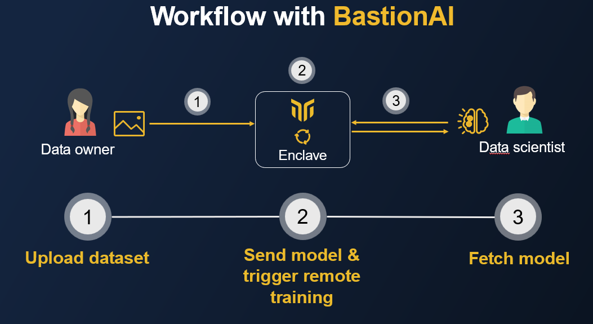

<p align="center">
  
</p>

<h1 align="center">Mithril Security – BastionAI</h1>

<h4 align="center">
  <a href="https://www.mithrilsecurity.io">Website</a> |
  <a href="https://bastionai.readthedocs.io/en/latest/">Documentation</a> |
  <a href="https://blog.mithrilsecurity.io/">Blog</a> |
  <a href="https://www.linkedin.com/company/mithril-security-company">LinkedIn</a> | 
  <a href="https://www.twitter.com/mithrilsecurity">Twitter</a> | 
  <a href="https://discord.gg/TxEHagpWd4">Discord</a>
</h4>

<h3 align="center">Fast, accessible and privacy friendly AI training 🚀🔒</h3>

BastionAI is a confidential deep learning framework that enables data scientists to train their models on sensitive data, while ensuring the data providers no third party will have access to these.

With BastionAI, you can:
- Have users send data to fine-tune a model in the Cloud without data being exposed in clear. 
- Securely train a model on datasets aggregated from multiple data sources, without any party having to show their data to the others.

BastionAI uses state-of-the art Privacy Enhancing Technologies, such as [Confidential Computing](https://blog.mithrilsecurity.io/confidential-computing-explained-part-1-introduction/) and [Differential Privacy](https://en.wikipedia.org/wiki/Differential_privacy) (DP), to protect data from being accessed by third parties. The server side is implemented using [Rust]((https://www.rust-lang.org/)) for enhanced memory safety. 🦀🦀

BastionAI supports confidential training of [PyTorch](https://pytorch.org/) models using a custom DP-SGD implementation inspired by [Opacus](https://github.com/pytorch/opacus). This enables Data Scientists to disclose trained models without leaking information about input data. It also leverages Confidential VMs technology to protect the input data while it is send or used for training. AMD SEV SNP will be covered first, and support for Intel TDX and Nvidia Confidential Computing will come later as these technologies mature and become more available.

## 🔒 Motivation

Today, most AI tools offer no privacy by design mechanisms: when multiple parties pool data to train an AI model  (e.g. for healthcare purposes), sensitive data can be exposed to multiple third parties, posing security and privacy threats.

Privacy Enhancing Technologies (PETs) have emerged as an answer to these issues. Differential Privacy, for instance, provides strong mathematical guarantees on the amount of information leaked by a computation whose output is publicly disclosed. Confidential Computing with secure enclaves makes it possible for Data Owners to have third parties manipulate their data in the Cloud, without exposing them in clear to anyone else.

However promising these technologies might be, finding secure and easy to use solutions still remains difficult. This is why we have built **BastionAI**, a confidential AI training framework, to make these technologies more accessible.

## 🚀 Quick tour

BastionAI is a confidential training framework, built on top of PyTorch. It allows Data Owners, for instance hospitals, to upload their datasets inside a remote Trusted Execution Environment (TEE), potentially located in the Cloud, to make them accessible to selected Data Scientists. Neither the Cloud provider nor the Data Scientist can read the uploaded data in clear, however, Data Scientist are still able to send their own models and to privately train them on the uploaded data.



Once BastionAI has been deployed in a TEE, the workflow is rather simple:
- The Data Owner uploads their datasets to the TEE.
- The Data Scientist locally defines their model before sending it to the TEE to be trained.
- Once trained, the model can be shared to the parties explicitly authorized by the Data Owner and the Data Scientist (who jointly own the trained weights).

Note that the *Data Scientist never has access to the dataset in clear*. At best they can only access the model's weights, which, thanks to the use of DP during training, cannot leak more information about the training dataset than allowed by the chosen DP guarantees.

Similarly, The *Cloud provider can't access neither the model nor the data* as TEEs provide end-to-end encryption. All data exclusively used inside the TEE are protected by hardware memory isolation and/or encryption.

### Installing BastionAI

Please refer to the Getting Started page of our official [documentation](https://bastionai.readthedocs.io/en/latest/getting-started/quick-start/).

### Finetune BERT on confidential data

We provide an example of how to privately fine-tune a BERT model on a small dataset for spam/ham classification. In the following, we assume the open source dataset we use should remain private.
This simple example may be extended to more complex scenarios, such as medical or legal document analysis.

The notebook with detailled model and data preparation can be found [here](examples/distilbert_example_notebook.ipynb).

#### Data owner POV

The Data Owner prepares their dataset before uploading it to the BastionAI server. 

```python
import bastionai

# Data preparation is detailled here
train_dataset = ... 

with bastionai.Connection() as client:
    client.RemoteDataset(
        train_dataset, 
        privacy_limit=6.0, 
        name="SMSSpamCollection"
    )
```

The dataset is simply a Pytorch [`Dataset`](https://pytorch.org/vision/stable/datasets.html) instance. The Data Owner connects to the remote server running inside the TEE and uploads the dataset. Under the hood, `bastionai.Connection()` secures the transfert with an attested TLS channel.

The Data Owner has the opportunity to set a `privacy_limit` which is the maximum Differential Privacy budget they allow the Data Scientist to consume. DP consumption is directly tracked by the code running inside the TEE for increased security gurantees. When the limit is reached the server does not allow any further processing.

#### Data scientist POV

The Data Scientist defines their model locally, sends it to the TEE and triggers training of the model on the owner's data.

```python
import bastionai

# Model preparation is detailled here
model = ...

with bastionai.Connection() as client:
    remote_dataset = client.list_remote_datasets()[0]
    
    remote_learner = client.RemoteLearner(
        model,
        remote_dataset,
        max_batch_size=4,
        loss="cross_entropy",
        optimizer=Adam(lr=5e-5),
        model_name="DistilBERT",
    )
    remote_learner.fit(nb_epochs=2, eps=2.0)
    trained_model = remote_learner.get_model()
```

Similarly, the Data Scientist connects to the TEE with `bastionai.Connection()`. They first query the server to get the list of remotely available datasets and choose the one they like. `client.get_available_datasets()` returns a list of `RemoteDataset` objects that are references to a remote dataset located in the TEE. This means the Data Scientist can play with the reference but never has direct access to the data.

Then, the Data Scientist bundles their local PyTorch's `nn.Module` model with all the (hyper)parameters necessary to train it on the specified `RemoteDataset`. Under the hood, the `RemoteLearner` class serializes the model in [TorchScript](https://pytorch.org/docs/stable/jit.html) and sends it to the TEE. This class was inspired by [fastai](https://docs.fast.ai/) `Learner` and has a similar high level interface. The use of TorchScript for serialization improves security by allowing the Data Scientist to execute a limited set of operations on the data.

To trigger training with the previously defined (hyper)parameters, the Data Scientist calls the `fit` method. They pass the desired number of epochs and DP budget and also have the opprotunity to override some of the previously defined (hyper)parameters. Note that the DP budget is global for the whole training procedure: our internal private learning library automatically computes the right per-step DP-SGD parameters.

Finally, once training is over, the Data Scientist may pull the trained model using the `get_model` method (if they are allowed to).

## ✅ Key Features

- **Confidentiality made easy**: Easily train state-of-the-art models with confidentiality thanks to the use of TEEs and Differential Privacy.
- **Transparency**: Provide guarantees to third parties, for instance clients or regulators, that you are indeed providing **data protection**, through **code attestation**.
- **Extensible usage**: Explore different scenarios from confidential multi party training of ResNets for cancer detection, to fine-tuning of GPT models on confidential text, such as emails or documents.

## :question:FAQ

**Q: How do I make sure the data I send is protected**

**A:** We leverage TEEs to provide end-to-end protection. This means that even though your data is sent to someone else to apply AI on it, it still remains protected thanks to hardware memory isolation and encryption.

We provide some information in our workshop [Reconcile AI and privacy with Confidential Computing](https://www.youtube.com/watch?v=tAT23GKMi_0).

You can also have a look at our series [Confidential Computing explained](https://blog.mithrilsecurity.io/confidential-computing-explained-part-1-introduction/).

**Q: Can I use BastionAI from a Python script?**

**A:** We only support a `fastai`-style API, where you provide a Pytorch `Dataset` and an `nn.Module`. This means Pytorch is needed to use our API from both the Data Owner and the Data Scientist persepectives. The choice of Pytorch brings both convenience and security: we cannot allow arbitrary computations inside the TEE as this can lead to [side-channels](https://en.wikipedia.org/wiki/Side-channel_attack) and information leakage. The internal use of TorchScript is a good way to lower this risk by restricting the set of allowed operations.

## Telemetry

BastionAI collects anonymous data regarding general usage, this allows us to understand how you are using the project. We only collect data regarding the execution mode (Hardware/Software) and the usage metrics.

This feature can be easily disabled, by setting the environment variable `BASTIONAI_DISABLE_TELEMETRY` to 1.

You can find more information about the telemetry in our [**documentation**](https://blindai.mithrilsecurity.io/en/latest/getting-started/telemetry/).

# :bangbang: Disclaimer

BastionAI is still in alpha and is being actively developed. It is provided as is, use it at your own risk.
