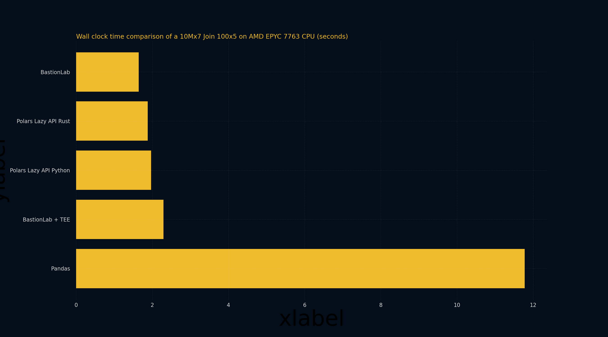

# Polars benchmarks
_________________________________

We don't want to improve data science privacy at the cost of your performance. This is why we have built BastionLab with speed as one of its main goals. For example, BastionLab uses Polars, a popular data science library coded in Rust, because it is far more efficient than Pandas, an even more popular one coded in Python. 

## Technical Specifications
_______________________________

To produce the following benchmarks, we compared BastionLab's performance with Polars' and Pandas' in various scenarios: **BastionLab** (the standard version), **BastionLab run within a Trusted Execution Environement** (TEE), **Polars Rust** (using the Lazy API which consumes less ressources), **Polars Python** (which is the same as Polars Rust but has python bindings; also using the Lazy API), and **Pandas** (the standard version).

> *(You can read [this guide]() to see what TEEs are and why you could need to use BastionLab with one.)*

All of the benchmarks use the same processor: **AMD EPYC 7763v** (with SEV-SNP disabled, except for BastionLab within a TEE which has SEV-SNP enabled).

We used a `join()` operation as our baseline operation. 

The memory benchmarks (memory usage) were tracked differently across Rust applications and Python applications. In Rust we used **jemalloc** to track memory usage and **memory_profiler** in Python.  When comparing memory usage benchmarks, we recommend comparing Python (Polars Python against Pandas) and Rust (BastionLab against Polars Rust).

These benchmarks were performed on Azure virtual machines, the specifications of the machines (cores and memory) can be found in each benchmark table.

## Benchmarking a 10Mx7 JOIN 100x5
______________________________________

This benchmark shows that BastionLab can perform a join operation faster than the other compared solutions - Pandas and Polars. 

The mean execution times indicate that using BastionLab is comparable to using Polars. BastionLab is still a little bit more performant, being 1.14 times faster than Polars Rust and 1.19 times faster than Polars Python. BastionLab is however 7.15 times faster than Pandas!

Using BastionLab within a TEE adds a slight overhead. BastionLab (without a TEE) is 1.39 times faster than BastionLab within a TEE.

|                        | Privacy                           | Processor      | Memory Usage (MB) | Standard deviation of Time | Mean Execution Time | Operation  | Total Runs (Same Parameters) | Cores | Memory |
| ---------------------- | --------------------------------- | -------------- | ----------------- | -------------------------- | ------------------- | ---------- | ---------------------------- | ----- | ------ |
| BastionLab + TEE       | SEV (Encryption) + Access Control | AMD EPYC 7763v |                   | 0.15951                    | 2.29914 s           | INNER JOIN | 10                           | 16    | 64 GB  |
| BastionLab             | Access Control                    | AMD EPYC 7763v | 12068.93436       | 0.06813                    | 1.64691 s           | INNER JOIN | 10                           | 16    | 64 GB  |
| Polars Lazy API Python |                                   | AMD EPYC 7763v | 16514.42188       | 0.05930                    | 1.97007 s           | INNER JOIN | 10                           | 16    | 64 GB  |
| Pandas                 |                                   | AMD EPYC 7763v | 18422.98438       | 0.54693                    | 11.78010 s          | INNER JOIN | 10                           | 16    | 64 GB  |
| Polars Lazy API Rust   |                                   | AMD EPYC 7763v | 11267.53197       | 0.05090                    | 1.884 s             | INNER JOIN | 10                           | 16    | 64 GB  |

## Benchmarking a 100Mx7 JOIN 100x5
____________________________________

When a larger join operation is performed, we see that using BastionLab remains comparable to using Polars in terms of average execution time. In this case BastionLab is 2.25 times faster than Polars Rust and 1.22 times faster than Polars Python. Here, again, BastionLab is much faster than Pandas with a 12.5 times better performance.

Running BastionLab within a TEE still presents a slight overhead, with BastionLab (without a TEE) being 1.24 times faster than BastionLab within a TEE.

|                        | Privacy                           | Processor      | Memory Usage (MB) | Standard deviation of Time | Mean Execution Time | Operation  | Total Runs (Same Parameters) | Cores | Memory |
| ---------------------- | --------------------------------- | -------------- | ----------------- | -------------------------- | ------------------- | ---------- | ---------------------------- | ----- | ------ |
| BastionLab + TEE       | SEV (Encryption) + Access Control | AMD EPYC 7763v |                   | 0.07252                    | 2.49139 s           | INNER JOIN | 10                           | 16    | 64 GB  |
| BastionLab             | Access Control                    | AMD EPYC 7763v | 22275.93819       | 0.05010                    | 1.99522 s           | INNER JOIN | 10                           | 16    | 64 GB  |
| Polars Lazy API Python |                                   | AMD EPYC 7763v | 18120.21875       | 0.13787                    | 2.43374 s           | INNER JOIN | 10                           | 16    | 64 GB  |
| Pandas                 |                                   | AMD EPYC 7763v | 18791.93359       | 0.65590                    | 24.94570 s          | INNER JOIN | 10                           | 16    | 64 GB  |
| Polars Lazy API Rust   |                                   | AMD EPYC 7763v | 14339.72344       | 0.05216                    | 4.507 s             | INNER JOIN | 10                           | 16    | 64 GB  |

To conclude, the benchmarks above show that BastionLab performs operations faster than available solutions. There is a slight overhead when using BastionLab within a TEE, but even then, it is still as fast as Polars and significantly faster than Pandas.
