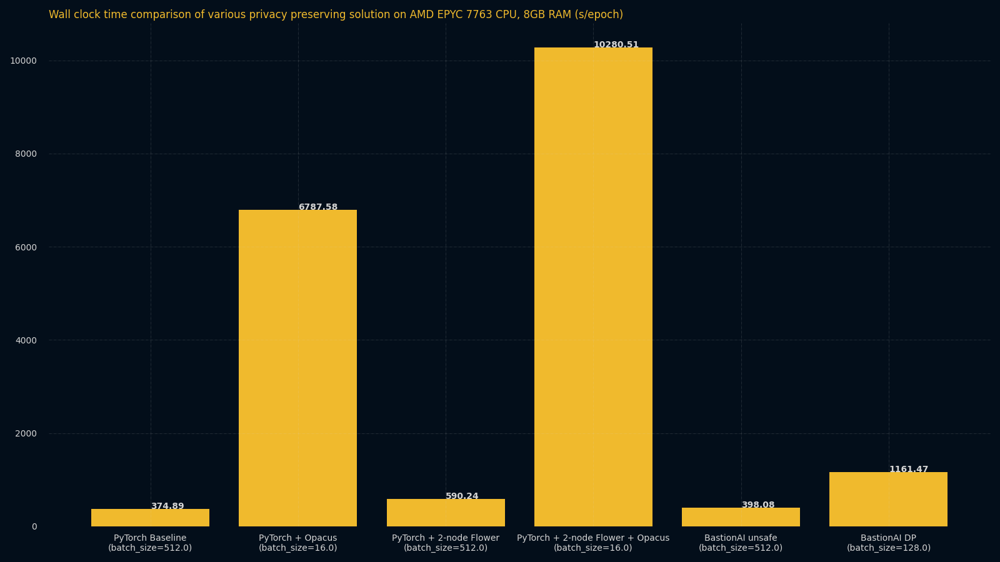
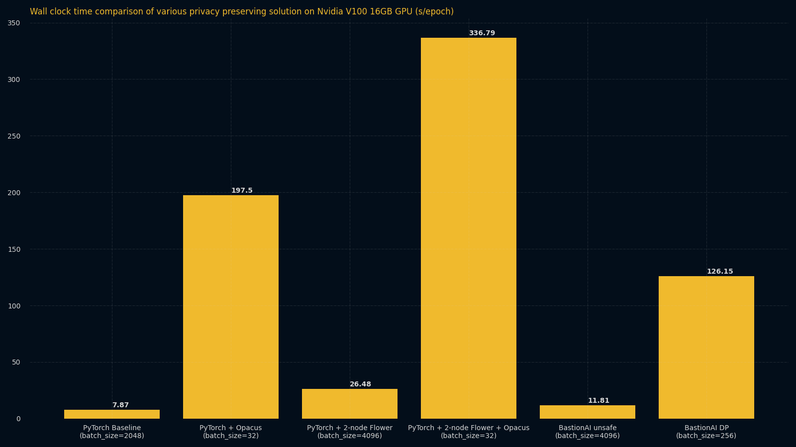
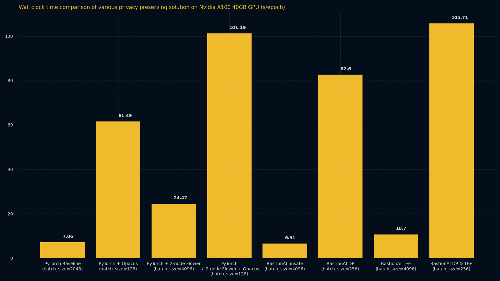

# Torch benchmarks
_____________________________

***# Here we need a little intro. Why did we run these benchmarks and why would it be useful to read for the person that's coming here (also, who is the person that might be interested in them? Figuring that out can help with figuring what to say)***

## Technical specifications
______________________________

These benchmarks were done by finetuning the EfficientNet B0 model on CIFAR100 dataset. You can have a look at the dataset used [here](https://www.cs.toronto.edu/~kriz/cifar.html).

***# why did you implement this process?***

## AMD EPYC 7763
____________________________

For the AMD benchmarks, we set the batch size to be the maximum possible, fitting in 8GB of RAM. 

***# why?***

You can have a look at the precise execution times in the following table:

|                                   |  Privacy   | SEV AMD EPYC 7763 Training Time (s/epoch) | AMD EPYC 7763 Training Time (s/epoch) | CPU Batch size |
| --------------------------------- | :--------: | :---------------------------------------: | :-----------------------------------: | :------------: |
| Pytorch (baseline)                |    None    |                                           |                374,89                 |      512       |
| PyTorch + Opacus                  | Incomplete |                                           |               6 787,58                |       16       |
| PyTorch + 2-party Flower          | Incomplete |                                           |                590,24                 |      512       |
| Pytorch + 2-party Flower + Opacus |     OK     |                                           |               10 280,51               |       16       |
| BastionLab Torch (no DP, no TEE)         | Incomplete |                                           |                398,08                 |      512       |
| BastionLab Torch (DP, no TEE)            | Incomplete |                                           |               1 161,47                |      128       |
| BastionLab Torch (no DP, TEE)            | Incomplete |                  262,22                   |                  N/A                  |       F        |
| BastionLab Torch (DP & TEE)              |     OK     |                                           |                  N/A                  |       F        |

## NVIDIA A100/v100 
____________________________

For the Nvidia benchmarks, we set the batch size to be the maximum possible, fitting in 16GB of GPU RAM, using a NVIDIA V100 GPU.

By using 40GB of GPU RAM on a NVIDIA A100 GPU, you obtain these results:

You can have a look at the precise execution times in the following table:

|                                   |  Privacy   | Nvidia V100 Training Time (s/epoch) | Nvidia V100 Batch size |
| --------------------------------- | :--------: | :---------------------------------: | :--------------------: |
| Pytorch (baseline)                |    None    |                7,87                 |        2 048,00        |
| PyTorch + Opacus                  | Incomplete |               197,50                |         32,00          |
| PyTorch + 2-party Flower          | Incomplete |                26,48                |        4 096,00        |
| Pytorch + 2-party Flower + Opacus |     OK     |               336,79                |         32,00          |
| BastionLab Torch (no DP, no TEE)         | Incomplete |                11,81                |        4 096,00        |
| BastionLab Torch (DP, no TEE)            | Incomplete |               126,15                |         256,00         |
| BastionLab Torch (no DP, TEE)            | Incomplete |                 N/A                 |        4 096,00        |
| BastionLab Torch (DP & TEE)              |     OK     |                 N/A                 |         256,00         |

|                                   |  Privacy   | Nvidia A100 Training Time (s/epoch) | Nvidia A100 Batch size |
| --------------------------------- | :--------: | :---------------------------------: | :--------------------: |
| Pytorch (baseline)                |    None    |                7,06                 |        2 048,00        |
| PyTorch + Opacus                  | Incomplete |                61,49                |         128,00         |
| PyTorch + 2-party Flower          | Incomplete |                24,47                |        4 096,00        |
| Pytorch + 2-party Flower + Opacus |     OK     |               101,19                |         128,00         |
| BastionLab Torch (no DP, no TEE)         | Incomplete |                6,51                 |        4 096,00        |
| BastionLab Torch (DP, no TEE)            | Incomplete |                82,60                |         256,00         |
| BastionLab Torch (no DP, TEE)            | Incomplete |                10,70                |        4 096,00        |
| BastionLab Torch (DP & TEE)              |     OK     |               105,71                |         256,00         |

***# do a conclusion for those benchmarks IF you have something else to say you haven't said before in the intro =)***