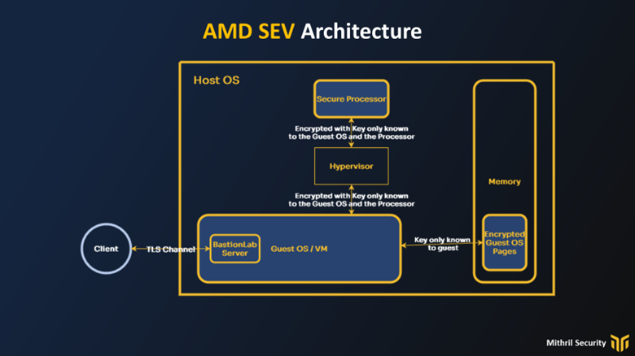
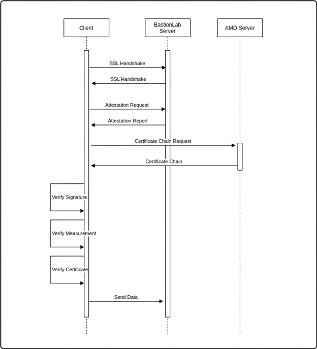

# Confidential Computing
__________________________________________________________________________

## Trusted Execution Environments
__________________________________________________________________________

**Bastion AI relies on hardware-backed privacy guarantees. It uses AMD SEV-SNP to ensure the confidentiality of the data provided to it.**

These hardware-backed confidentiality computing approaches are called Trusted Execution Environments or TEEs. You will see those three letters a lot from this point on since they are key to understanding the guarantees we provide.

TEEs use specialized hardware that generally applies:

* memory isolation, preventing any unauthorized access to the TEE.

* memory encryption, ensuring data is always encrypted in memory and incomprehensible to anyone that tries to access it.

## Types of TEEs

### Intel SGX

Intel SGX is the most popular. Its TEEs, called enclaves, are special memory regions within the processor that cannot be accessed directly (isolation). These memory regions are also encrypted by a key that is randomly generated every boot cycle (encryption). This encryption key is generated and stored within the processor and is inaccessible. 

The enclave memory has limitations, like its size and integration with other hardware devices (such as GPUs), but its small footprint makes it easier to secure. It also requires its own SDK to develop an enclave program. Our confidential inference server, BlindAI, is designed to work on Intel SGX.

### AMD SEV-SNP

AMD SEV-SNP is a newer confidential computing platform and takes a different approach from Intel SGX. It considers that the TEE is an entire guest operating system.

This means there is a larger footprint to secure, but it also allows for easier development: it doesn't require an SDK and the experience is the same as when developing on a machine with no protection. It also simplifies integration with hardware devices.

AMD SEV-SNP considers everything outside of the guest OS to be untrusted, i.e the hypervisor, other virtual machines and the host operating system. At launch, the pages that belong to the guest OS are encrypted and integrity-protected. This means they cannot be read or altered by the hypervisor, the host OS or other guest OS. The key here, is that any attempt to access the pages of the guest OS would be blocked by the processor (isolation) and if you did manage to access a guest page you'd only find encrypted content (encryption). This is ensured by the AMD secure processor which is a part of the trusted computing base (TCB).

AMD SEV-SNP provides full memory encryption during runtime. Data is individually decrypted only *during* use by a dedicated encryption/decryption engine, and immediately re-encrypted again *after* use. The encryption key is only known to the guest's virtual machine.

AMD SEV-SNP ensures that virtual machines running on cloud environments are confidential from the cloud providers themselves. It allows users to run sensitive workloads on the cloud, while not having to trust anything other than their own code and the AMD SEV-SNP hardware. They don't need to trust cloud providers not to spy on their data. They also don't need to trust their infrastructure not to leak information because of bugs.

## Attestation
__________________________________________________________________________

TEEs are, at the core, black boxes to run code. This is great for security and privacy because what happens there is guaranteed to stay there. But we're still missing crucial information: since we can't see inside, how do we know that what happens in the TEE is *what* we want to happen there? How do we know we're communicating with a TEE? How do we know if the TEE is secure? How can we verify that this TEE is the one we're expecting?\
Attestations are the answer.

Attestations are a core function of TEEs. They provide the means for an end-user to identify the TEE, and verify and validate the code running within a TEE *before* sending any of their data to the TEE.

Attestation is performed using Public Key Infrastructure (PKI) and a measurement of the TEE code.

The procedure is as follows:

1.  The TEE generates an attestation report. This report contains a hash of all the code within the TEE (and a lot more information but this is what we'll focus on), this is called a measurement.

>*`hash`

>A hash is a cryptographic function that produces a unique string for an arbitrary length input provided to it. This means that for the same input, the hash output would be the same, but if a single byte changes in the input, the hash output would be drastically different.*

This provides a way for the end-user to verify that the code running within the TEE is the code they expect. The end-user must also have access to the same code so they may generate the hash on their end to compare against the hash the TEE sends.\
This is why we open-source our source code at Mithril Security: any user can compute the expected measurement and compare it against the measurement received in the attestation report.

2. However, the attestation report cannot be trusted on its own. Say the report wasn't sent by a TEE, or that the TEE is running different code and sent a report with the expected measurement to trick the end user. How do we trust this report?\
This is where Public Key Infrastructure provides a way to authenticate the TEE.

The attestation reports generated by a TEE are signed by a key unique to that TEE or Processor, depending on the TEE implementation.

The signature generation and validation are as follows:

1.  A hash of the attestation report is generated.

2.  This hash is signed (*encrypted*) using the signing key (*private key*) of the TEE.

3.  The signed hash is appended to the report.

4.  The end user receives the report and the certificate(s) from the TEE.

5.  The end user uses the certificate (which contains the public key of the TEE) to decrypt the signed hash and retrieve the hash of the report. Then they compare the received hash against a hash of the attestation report they compute themselves.

6.  If the hashes match, the end-user only needs to prove that the signing key is authentic and belongs to a trusted TEE.

7.  We prove this by validating the certificate chain linked to the signing key.

Certificate chain validation is performed as follows:\
The private TEE Signing Key has a certificate containing its public key (Certificate 1)

Certificate 1 is signed by another private key whose public key certificate is available from the manufacturer (Root certificate**).

We retrieve the **Root certificate** from the manufacturer's server and use it to verify that Certificate 1 has been signed by the **Root certificate's private key.

As we trust Root certificate** (because we got it from the manufacturer's server) we know that Certificate 1 is also trustworthy.

This is a simplified explanation of certificate chain validation. In reality, there are more certificates being signed between the TEE's certificate and the Root certificate**. But as long as it ends up linking to a Root certificate the TEE's certificate and signature can be trusted.

An additional feature of Attestations, is that the end-user can send some information they want to be included in the report -to prove that the certificate is freshly-generated, for example.

BastionLab's Client performs all of these checks each time it connects to a server. It will warn or block the user from communicating with the server if the checks fail. Since the code is open-source the end-users can also do these checks by themselves, if required.

!!! note "Attestations in BastionLab"
	 As BastionLab uses AMD SEV-SNP, the measurement is a hash of every file in the virtual machine image. This is because, unlike with Intel SGX, in AMD SEV-SNP the entire virtual machine *is the TEE. Any alteration, addition, or deletion of files in the virtual machine would change the measurement returned in the attestation report.

## Data-in-use
__________________________________________________________________________

BastionLab uses AMD SEV-SNP as its TEE. Data while being processed is secure through two security features of AMD SEV-SNP

1.  As we explained above in the types of TEEs, the memory of the SEV-SNP virtual machine (RAM) is always encrypted, only the memory currently being processed is decrypted by a dedicated encryption/decryption engine. Once processed, it is immediately re-encrypted in memory.

This protects the data from ever being exposed. Even if the memory is forcefully dumped, causing a leak of the data, all the contents would still be encrypted with a key known only to the virtual machine.

2.  The memory pages of a SEV-SNP virtual machine are **isolated from access requests from unauthorized parties including the operating system. As a result, any attempt to read the memory of the virtual machine is blocked by the processor, which is trusted and secure.

This prevents any snooping from the operating system, other processes, other virtual machines on the same host, etc.