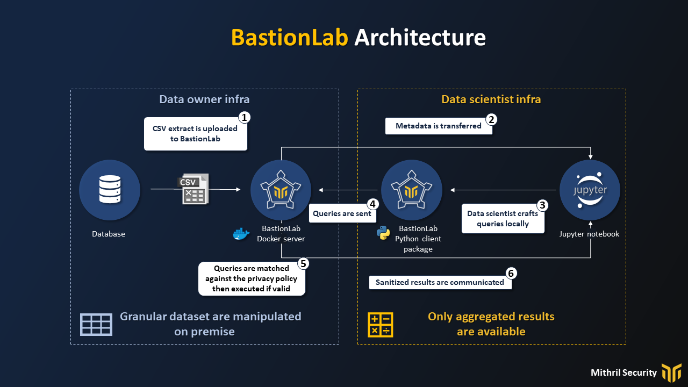

# Remote data science
__________________________________________________________

In this concept guide, we'll explain why current solutions to share data with remote data scientists are not sufficient, how a remote data science framework can answer it, and how BastionLab has implemented it.

## Why we need it
________________________________________________________________

Data owners often need or wish that remote data scientists would access their datasets - like a hospital might want to valorize their data to external parties, startups, labs, or receive help from external experts, for instance. 

But how can we open data to outsiders while giving a good user-experience for the data scientist and providing a high-enough level of security and privacy for the shared data? 

One of the most popular solutions is to give access to a Jupyter Python notebook installed on the data owner infrastructure. This is dangerous, because it exposes the dataset to serious data leakages. Jupyter was *not* made for this task and exfiltrating data can easily be done. For example, rows can be printed little by little until the whole dataset is extracted, or a malicious data scientist could exfiltrate a trained neural network in which the whole dataset has been hidden in the weights.

This is possible because the data scientist can run arbitrary Python scripts on the data to perform extraction attacks. It makes it extremely complicated to try to analyze their queries to detect fraudulent behavior: static and dynamic analysis tools would be inefficient because Python code is too dynamic and expressive.

That is why we have built BastionLab, a data science framework to perform remote and secure Exploratory Data Analysis. The following plan illustrates the architecture of our solution and the workflow we implement:

There are a few key differences between a remotely accessed Jupyter notebook and the use of our remote data science framework.

In the remotely accessed Jupyter notebook, the data scientist has direct access to the data, can run arbitrary code on it, and can see the results of the output. 

In the remote data science framework, only a restricted set of operations is authorized on the data. Instead of allowing  arbitrary remote code execution, the only *execute operations* allowed are ones needed for data science, like joins, mean, train, etc. Those operations can be analyzed and blocked if they don't answer the data owner's privacy policy.

### Takeaways

When remotely connecting to a Jupyter notebook

-   The data scientist basically has a direct access to the entirety of the dataset

-   They can also send arbitrary Python code to be executed and exfiltrate data

A remote data science framework comes to solve that problem by ensuring the data scientist can *only* access the dataset and the database through a sanitized interface that allows the data owner to have full control.

## How it works
_______________________________________________________

A remote data science framework acts as a filter barrier. In the case of BastionLab, only pre-coded operations approved by the data owner can be run on the data. The results shared with the data scientist are also finely controlled. 

This is enabled by four principles:

-   The data scientist never has access to the data directly

-   The data scientist manipulates on their machine only a local object that contains metadata to interact with a remotely hosted dataset

-   The data scientist interacts with the remotely hosted objects only through remote proccedure calls that are transparent to them

-   Those requests are analyzed and matched against a privacy policy defined by the data owner, so that only allowed operations are executed and sanitized results returned

By incorporating those four principles, it becomes possible for a data scientist to interact with a data scientist remotely, and iterate quickly on it, without sacrificing security and privacy because:

Since remote data science faces terrible consequences in case of leaks, it's critical to ensure:

-   That no data is exposed in clear

-   That only a certain set of sanitized operations can be executed on the data

-   That the operations executed during a session are always matched against the privacy policy - to make sure that only allowed operations can be used on the data

## How we do it
__________________________________________________

In this part, we'll go over the details of how remote data science is implemented in BastionLab. 

We'll outline three different concepts and provide an in-depth presentation of their implementation through the RemoteLazyFrame object.

### Remote Objects

BastionLab works with Remote Objects to guarantee both privacy and ease-of-use by data scientists .

From the data scientist's perspective, Remote Objects are a pointer to a remote resource, hosted on the data owner infrastructure. They serve as an abstraction to query the remote dataset *as if* the data were available locally, but technically it is **never** the case.

Queries are often crafted in a lazy manner locally - this means that nothing is executed locally (which is logical as the data is *not* on the data scientist's perimeter). When we want to run a computation, then some methods can be used to serialize the request and send it for remote execution. 

Our solution, RemoteLazyFrames, is one method to do so. We'll introduce it in a few sections down this guide.

### Limited expressivity

Arbitrary code execution, as we saw previously, can be a cause of great headaches in terms of security. That is why we aim to reduce as much as possible the amount of code we need to trust (also called the Trusted Execution Base). 

To do so, we provide a computational engine specific to the task at hand, instead of providing a Python interpreter to the data scientist. This reduces drastically the ability of the data scientist to inject malicious code to extract the datasets. It also allows us to better optimize the computation executed because it fits a specific pattern (like neural network or data frame query).

### Sanitized outputs

To sanitize outputs, we allow a  limited number of operators to be executed by the data scientist. We also make sure that the only outputs which can be shared respect a privacy policy defined by the data owner.

For example, we could only allow differentially private outputs to be shared, or not allow raw information to be printed on the data scientist interface.

### Our Solution: the **RemoteLazyFrame**
___________________________________________________________

The RemoteLazyFrame, a remote privacy-friendly version of a DataFrame, implements all these features:

-   **Remote Object:** the RemoteLazyFrame is a pointer to a remote data frame. Queries are built locally in a lazy method, are sent for execution through the `.collect()` method, and results are pulled with `.fetch()`

-   **Limited expressivity:** only polars operators are supported, like mean, join, std, etc. This means no Python code is directly executed on the data.

-   **Sanitized outputs:** a privacy policy can be put in place to only allow aggregate results to be shared or if rows have to be shared, only after approval from the data owner.

BastionLab allows the data owner to specify the constraints under which data scientists may download results by customizing an access policy. Access policies are defined for each remote object sent by the data owner and are inherited by the results computed using these remote objects. 

They support two access modes, either automatic or by requesting the data owner's approval, that both correspond with a set of constraints. The checks run as follows: if the constraints for automatic access are fulfilled, the server directly returns the data. Otherwise, it checks the constraints for approval mode, and, if they are fulfilled, sends a request to the data owner who can accept or reject it. If none of the two sets of constraints are fulfilled, the data owner cannot download the results.

The default policy used for DataFrames automatically accepts that the data scientist downloads aggregated results (with a constraint on the number of rows of the original DataFrame per group) and requires the data owner's approval in all other cases. In addition to this mechanism, the data owner can define a blacklist of columns that would be wiped (replaced with '\*') if downloaded.
