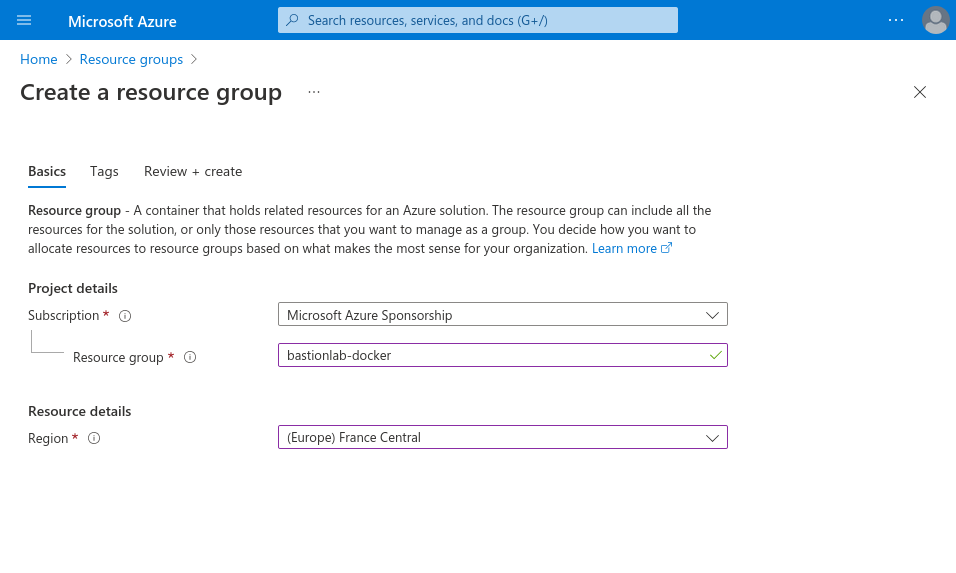
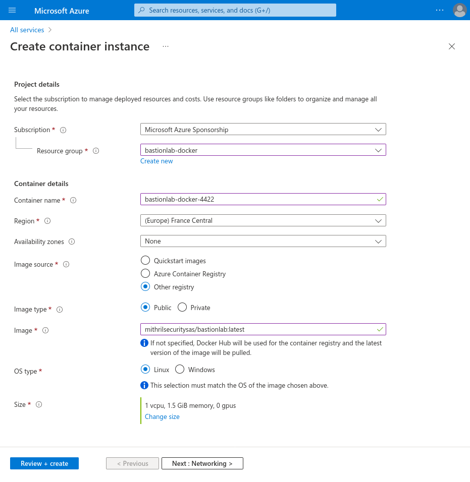
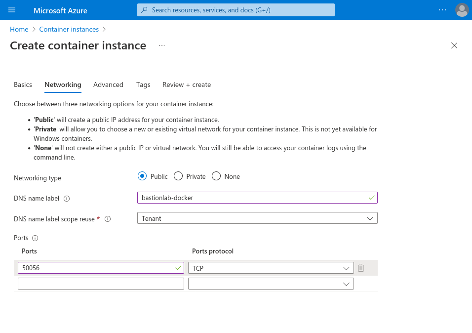
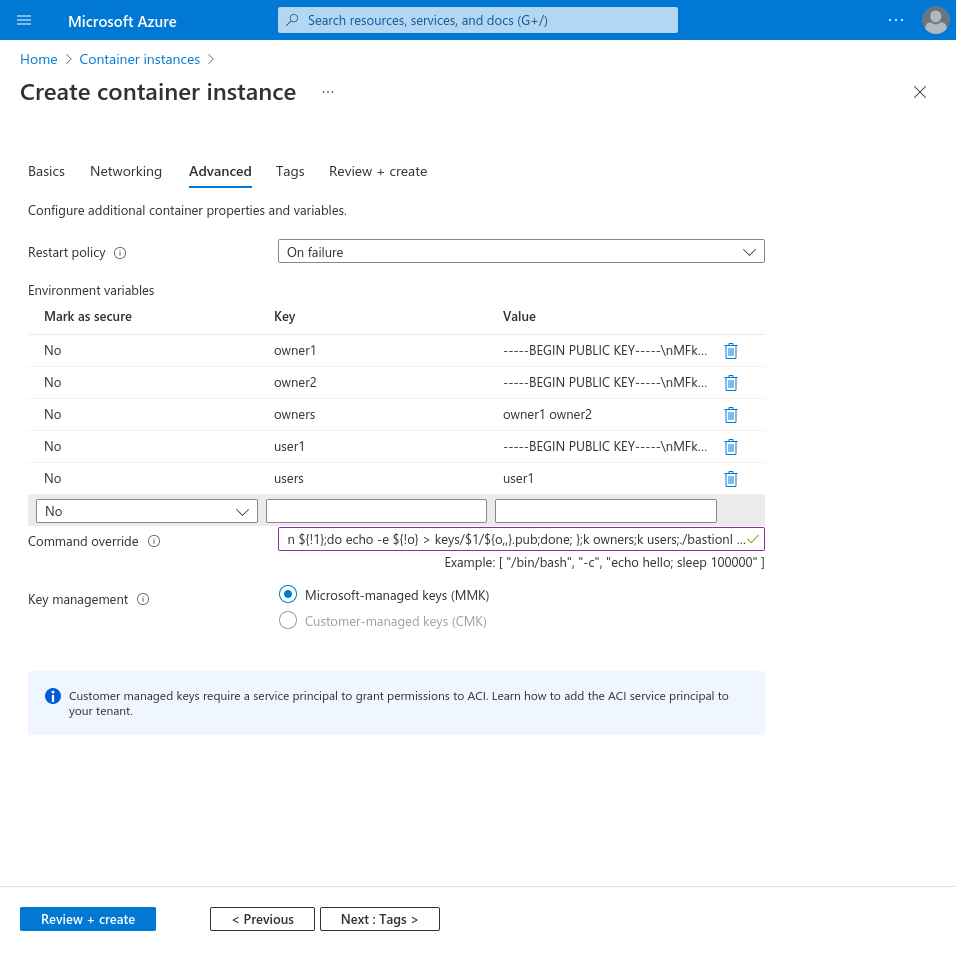
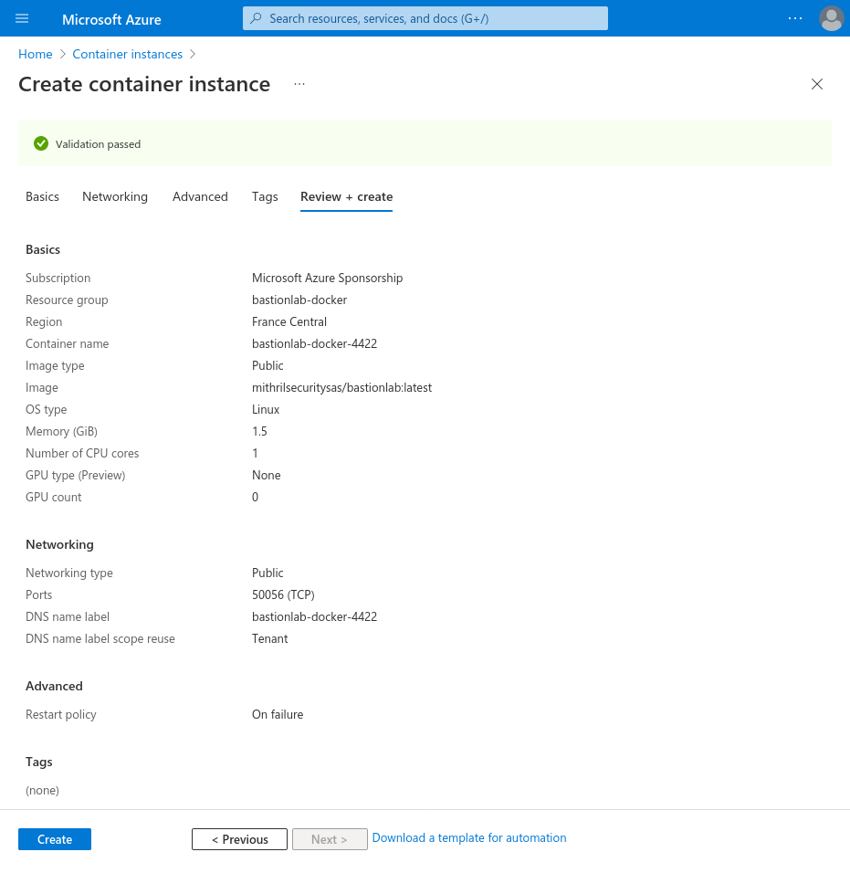
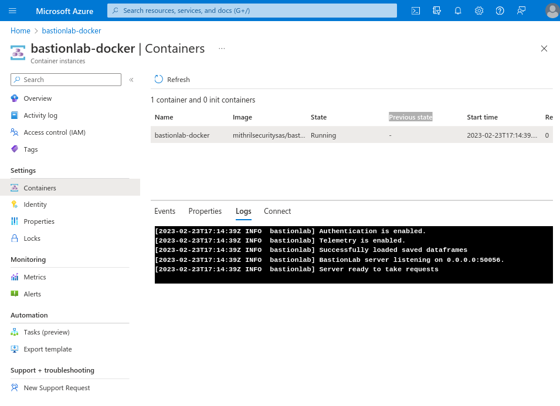
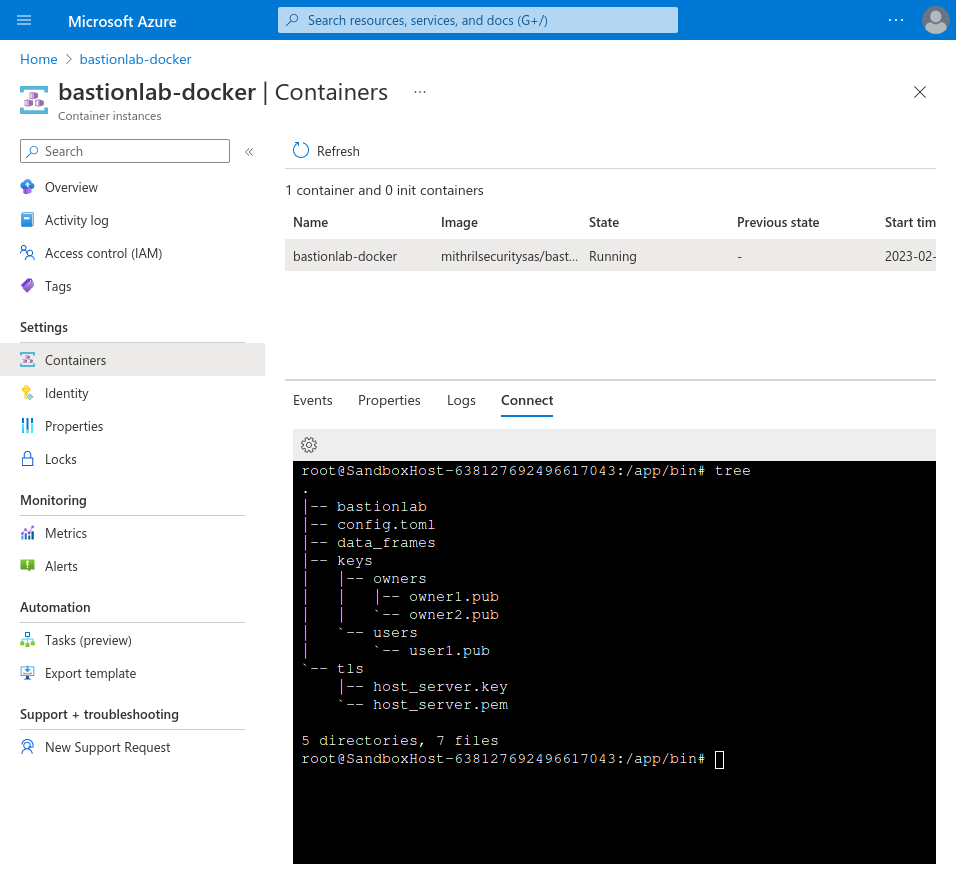
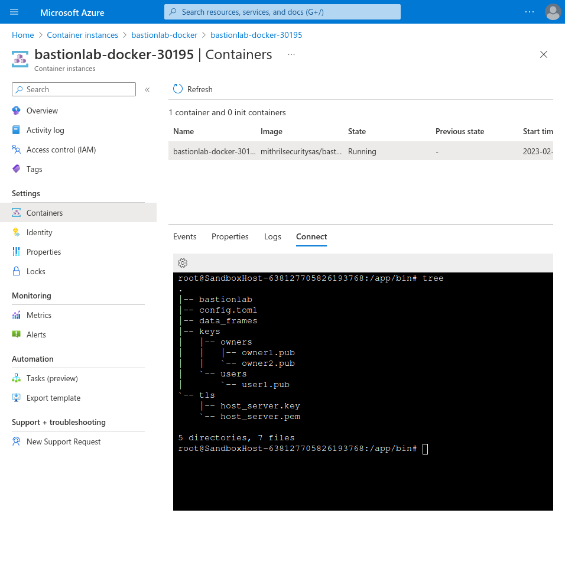

# Deploy on Azure
____________________________________________

Get started and **Deploy BastionLab Server**

## Pre-requisites
___________________________________________

### Requirements

To deploy **BastionLab Server**, ensure the following requirements are satisfied:

- [Azure account](https://portal.azure.com/)
    - If you would like to follow along but don't have an [Azure account](https://docs.microsoft.com/en-us/azure/guides/developer/azure-developer-guide#understanding-accounts-subscriptions-and-billing), make sure to create a [free](https://azure.microsoft.com/free/?ref=microsoft.com&utm_source=microsoft.com&utm_medium=docs&utm_campaign=visualstudio) one before you start.

If deploying with **Azure CLI** in your local environment, then you will need to install:

- [Azure CLI](https://learn.microsoft.com/en-us/cli/azure/)
    - To get the latest version of Azure CLI for your system, you can go to: [https://www.python.org/downloads/](https://www.python.org/downloads/)
    - or use a one line command for **debian-based** distros:
  ```bash
  curl -sL https://aka.ms/InstallAzureCLIDeb | sudo bash
  ```

> Be mindful when creating and deleting resources as some of the samples presented in this article may result in charges, especially if certain deployment settings are chosen or if your application is left running for an extended period. To avoid incurring any unexpected costs, please be sure to review the documentation and billing pages closely prior to any deployments.

## Deploying with Azure Portal
_____________________________________________

First you will need to login to your [Azure Portal](https://portal.azure.com/) and create a **resource group**.
### Create a Resource Group


### Create a Container Instance
Now go to the **Container instances** section in your azure portal.
#### Basic configuration
Choose your *resource group*, *container name* and *region*.
Then to select the bastionlab docker image, choose the **other registry** option and then **public**.

You can copy and paste the image from here:

```    
mithrilsecuritysas/bastionlab:latest
```



#### Networking
Let the **public type networking** option, set your DNS label and set the port to **50056**.



Leave all other settings as their defaults, then select Review + create.

#### Advanced Section
Here you will define the keys used for authenticating on the server.
It is important that the **values** of the **keys** have their break lines replaced by the literal value "\n".

```bash
cat your_key.pub | sed ':a;N;$!ba;s/\n/\\n/g'
# your_key.pub:
# -----BEGIN PUBLIC KEY-----
# MFkwEwYHKoZIzj0CAQYIKoZIzj0DAQcDQgAEmRmCI6VPiVsZwJGlfkFPIg9b1tad
# c2YwsxfksNvtNcHCo8ZlMUR5mBBWvo6KiLXmwmLxXzMK2IMl6CHf+2YHFQ==
# -----END PUBLIC KEY-----
# Output:
# -----BEGIN PUBLIC KEY-----\nMFkwEwYHKoZIzj0CAQYIKoZIzj0DAQcDQgAEmRmCI6VPiVsZwJGlfkFPIg9b1tad\nc2Ywsxf>
```

And it is also important to create one key named `owners`, that contains the names of every *ownerN* key, and also a `users` key that contains the names of every *userN* key.

Last step, but as important as the others, set the **command override** as:

##### Command override
```bash
["/bin/bash", "-c", "k(){ mkdir -p keys/$1;for o in ${!1};do echo -e ${!o} > keys/$1/${o,,}.pub;done; };k owners;k users;./bastionlab"]
```
##### Equivalent
```bash
k()
{
	mkdir -p keys/$1
	for o in ${!1}
	do
		echo -e ${!o} > keys/$1/${o,,}.pub
	done
}
k owners
k users
./bastionlab
```


#### Review + Create
Review the settings and create the container instance.




And **Congratulations!** Your *BastionLab server* is deployed!

You can confirm it's running by seeing the log on your **bastionlab-docker** container page.



Or connect to the instance terminal in the same page.



### Quick Reference
##### Replace break lines by \n in your public key
```bash
cat your_key.pub | sed ':a;N;$!ba;s/\n/\\n/g'
```
##### Command override
```bash
["/bin/bash", "-c", "k(){ mkdir -p keys/$1;for o in ${!1};do echo -e ${!o} > keys/$1/${o,,}.pub;done; };k owners;k users;./bastionlab"]
```
##### BastionLab server image
```
mithrilsecuritysas/bastionlab:latest
```

## Deploying with Azure CLI
______________________________________________

First you will need to login with the command:
```bash
az login
```
### Basic Configuration Setup
Make sure to set *resource group name*, *app name*, *location* and the *docker image* variables according to your needs.

#### Set Variables (with example values)
```bash
resourceGroupName="bastionlab-docker"
appName="bastionlab-docker-$RANDOM"
location="eastus"
bastionLabImage="mithrilsecuritysas/bastionlab:latest"
owner1=$(cat owner1_key.pub | sed ':a;N;$!ba;s/\n/\\n/g')
owner2=$(cat owner2_key.pub | sed ':a;N;$!ba;s/\n/\\n/g')
owners="owner1 owner2"
user1=$(cat user1_key.pub | sed ':a;N;$!ba;s/\n/\\n/g')
users="user1"
```
### Create a Resource Group
```bash
az group create --name $resourceGroupName --location $location
```

### Deploy BastionLab Server as a Container App
```bash
az container create \
        --name $appName \
        --resource-group $resourceGroupName \
        --image $bastionLabImage \
        --dns-name-label $appName \
        --ports 50056 \
	--environment-variables owner1="$owner1" owner2="$owner2" owners="$owners" user1="$user1" users="$users" \
	--command-line '/bin/bash -c "k(){ mkdir -p keys/$1;for o in ${!1};do echo -e \"${!o}\" > keys/$1/${o,,}.pub;done; };k owners;k users;./bastionlab"'

```

### Show FQDN and Provisioning State

To display the container's fully qualified domain name (FQDN) and its provisioning state, you can run:

```bash
az container show \
	--resource-group $resourceGroupName \
	--name $appName \
	--query "{FQDN:ipAddress.fqdn,ProvisioningState:provisioningState}" \
	--out table
```

If the `ProvisioningState` is **Succeeded**, congratulations! You have deployed succesfully your application in a running Docker container on Azure Cloud.

```bash
FQDN                                                     ProvisioningState
-------------------------------------------------------  -------------------
bastionlab-docker-30195.francecentral.azurecontainer.io  Succeeded
```

You can also manage your BastionLab Server instance in your portal.




