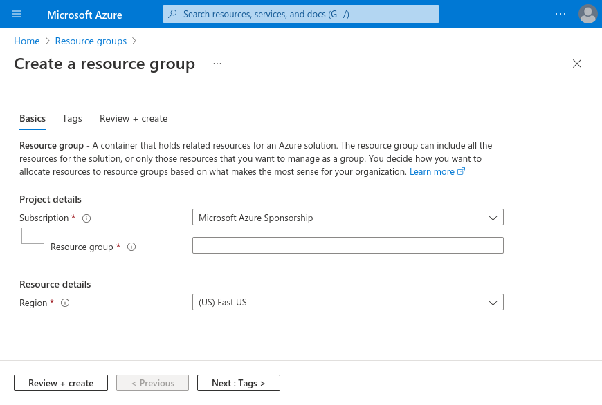

# Deploy on Azure
____________________________________________

Get started and **Deploy BastionLab Server**

## Pre-requisites
___________________________________________

### Requirements

To deploy **BastionLab Server**, ensure the following requirements are satisfied:

- [Azure account](https://portal.azure.com/)
    - If you would like to follow along but don't have an [Azure account](https://docs.microsoft.com/en-us/azure/guides/developer/azure-developer-guide#understanding-accounts-subscriptions-and-billing), make sure to create a [free](https://azure.microsoft.com/free/?ref=microsoft.com&utm_source=microsoft.com&utm_medium=docs&utm_campaign=visualstudio) one before you start.

If deploying with **Azure CLI** in your local environment, then you will need to install:

- [Azure CLI](https://learn.microsoft.com/en-us/cli/azure/)
    - To get the latest version of Azure CLI for your system, you can go to: [https://www.python.org/downloads/](https://www.python.org/downloads/)
    - or use a one line command for **debian-based** distros:
  ```bash
  curl -sL https://aka.ms/InstallAzureCLIDeb | sudo bash
  ```

> Be mindful when creating and deleting resources as some of the samples presented in this article may result in charges, especially if certain deployment settings are chosen or if your application is left running for an extended period. To avoid incurring any unexpected costs, please be sure to review the documentation and billing pages closely prior to any deployments.

## Deploying with Azure Portal
_____________________________________________

First you will need to login to your [Azure Portal](https://portal.azure.com/) and create a *resource group*.


## Deploying with Azure CLI
______________________________________________

First you will need to login with the command:
```bash
az login
```
### Setup App Service
Make sure to set *resource group name*, *app name*, *location* and *app service plan name* variables according to your needs.

#### Set variables (example)
```bash
resourceGroupName="myResourceGroup"
appName="webappwithcosmosdb$RANDOM"
location="eastus"
appServicePlanName="$appName-ASP"
```
#### Create a Resource Group
```bash
az group create --name $resourceGroupName --location $location
```
#### Create an App Service Plan
```bash
az appservice plan create --resource-group $resourceGroupName --name $appServicePlanName --sku S1 --location $location
```
#### Create a Web app in the App Service Plan
```bash
az webapp create --name $appName --plan $appServicePlanName --resource-group $resourceGroupName
```
#### Upload BastionLab's server code
```bash
az webapp deployment source config --resource-group $resourceGroupName --name $appName --repo-url https://github.com/mithril-security/bastionlab.git --branch main --manual-integration
```