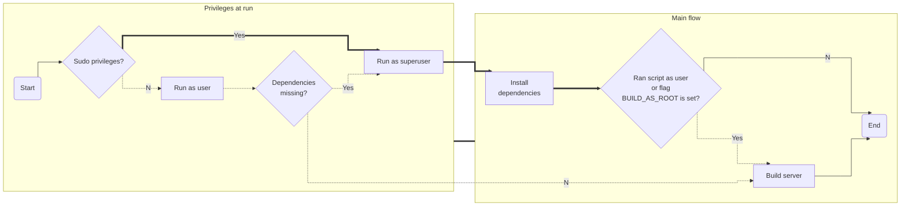

# Installation
____________________________________________

Get started and **install BastionLab Client** and **BastionLab Server**.

## Pre-requisites
___________________________________________

### Technical requirements

To install **BastionLab Client and BastionLab Server**, ensure the following are already installed in your system:

- Python3.7 or greater *(get the latest version of Python at [https://www.python.org/downloads/](https://www.python.org/downloads/) or with your operating system’s package manager)*
- [Python Pip](https://pypi.org/project/pip/) (PyPi), the package manager

To install **BastionLab Server**, you'll also need:

- [Docker](https://www.docker.com/) 

*Here's the [Docker official tutorial](https://docker-curriculum.com/) to set it up on your computer.*

## Installing BastionLab Client
_____________________________________________

### From PyPI

```bash
pip install bastionlab
```

### From source

First, you'll need to clone BastionLab repository:
```bash
git clone https://github.com/mithril-security/bastionlab.git
```
Then install the client library:
```bash
cd ./bastionlab/client
make dev-install
```

## Installing BastionLab Server
______________________________________________

### From PyPI

For **testing purposes only**, BastionLab server can be installed using our pip package.

!!! warning

	This package is meant to quickly setup a running instance of the server and is particularly useful in colab notebooks. It does not provide any mean to configure the server which makes certain features impossible to use (like [authentication](../../../docs/tutorials/authentication/)).

	**For production, please use the Docker image or install the server from source.**
    
```bash
pip install bastionlab-server
```

Once installed, the server can be launched using the following script:

```py
import bastionlab_server
srv = bastionlab_server.start()
```

And stoped this way:

```py
bastionlab_server.stop(srv)
```

### Using the official Docker image

```bash
docker run -p 50056:50056 -d mithrilsecuritysas/bastionlab:latest
```

### Configuring the Docker image
If you want to use a custom configuration file, you can do so with the following code block:
```
docker create -p 50056:50056 --name bastionlab-srv mithrilsecuritysas/bastionlab:latest
docker cp <your_updated_config>.toml bastionlab-srv:/app/bin
docker start bastionlab-srv
```

To serve as a reference, here's the default config.toml:
```
--8<-- "server/tools/config.toml"
```

### By locally building the Docker image

Clone the repository and build the image using the Dockerfile:
```bash
git clone https://github.com/mithril-security/bastionlab.git
cd ./bastionlab/server
docker build -t bastionlab:0.1.0 -t bastionlab:latest .
```
Then run a container based on the image:
```bash
docker run -p 50056:50056 -d bastionlab
```

### Building the Docker image with GPU access

#### Prerequisites
Visit the  for downloading and installing the appropriate drivers.
Reboot your system and make sure your GPU is running and accessible.

#### Install nvidia-container-runtime
For Debian-like systems or [others](https://nvidia.github.io/nvidia-container-runtime/).

Add the *nvidia-container-runtime* repository to your list of repositories:
```bash
# Get the GPG key
curl -s -L https://nvidia.github.io/nvidia-container-runtime/gpgkey | \
  sudo apt-key add -
# Get the distribution
distribution=$(. /etc/os-release && echo $ID$VERSION_ID)
# Add repository to list
curl -s -L https://nvidia.github.io/nvidia-container-runtime/$distribution/nvidia-container-runtime.list | \
  sudo tee /etc/apt/sources.list.d/nvidia-container-runtime.list

sudo apt update
```
Install *nvidia-container-runtime* and restart docker service:
```bash
sudo apt install nvidia-container-runtime
sudo systemctl restart docker 
```
#### Build and run the image
Clone the repository and build the image using the Dockerfile:
```bash
git clone https://github.com/mithril-security/bastionlab.git
cd ./bastionlab/server
docker build -t bastionlab:0.3.7-gpu -f Dockerfile.gpu.sev .
```
Then run a container based on the image, exposing the GPUs for use and with NVIDIA recommended flags:
```bash
docker run --gpus all --ipc=host --ulimit memlock=-1 --ulimit stack=67108864 -p 50056:50056 bastionlab:0.3.7-gpu
```
### From source

#### Automated build
Before using the automated build, make sure to run it in a RHEL, Debian or Arch based linux distro. The script will detect on the run on which distro it is running.

The **build.sh** script must be ran inside the *server's directory*, it will check and install all the necessary dependencies to build the server, if needed, and then it will start building it.

```bash
git clone https://github.com/mithril-security/bastionlab.git
cd bastionlab/server/
./build.sh
```
##### Environmental variables
- `LIBTORCH`
  - If the LIBTORCH envar is already set, the script will use this path to build the server.
- `CUDA`
  - If the CUDA envar is already set, the script will use this path to build the server.
- `INSTALL_RUST_OPT`
  - It is to set the options for **rustup** installation (To choose the default host, **toolchain**, profile, ...).
  ```bash
  export INSTALL_RUST_OPT='--profile minimal --default-toolchain nightly'
  ./build.sh
  ```
- `BASTIONLAB_BUILD_AS_ROOT`
  - If it is necessary to build the project as the **root user**, you need to set this variable before running the script.
  - If the variable is not set when running as root, the **dependencies will be installed** but the project will not be built.
  ```bash
  ./build # Running this as root will install the dependencies
  ```
  ```bash
  export BASTIONLAB_BUILD_AS_ROOT=1
  ./build.sh # Running this as root and with the flag set will install AND build the server
  ```
- `BASTIONLAB_CPP11`
  - If it is necessary to build the project using C++11, you need to set this variable before running the script. 
  - It will install and setup C++11 before building. 
  ```bash
  export BASTIONLAB_CPP11=1
  ./build.sh
  ```

###### Flow chart



#### Manual build

First make sure that the following build dependencies (Debian-like systems) are installed on your machine:
```bash
sudo apt-get update && apt-get -y install build-essential libssl-dev pkg-config curl unzip
```

Then, clone our repository:
```bash
git clone https://github.com/mithril-security/bastionlab.git
```
Download and unzip libtorch (Pytorch's C++ backend) from [Pytorch's website](https://pytorch.org/) (you can chose the right build according to your cuda version):
```bash
cd ./bastionlab
curl -o libtorch.zip $(. ./.env.vars && echo "${TORCH_CXX11_URL}")
unzip libtorch.zip
```
Libtorch binaries are now available under the libtorch folder. You can now turn to building the server crates:
```bash
cd server
make build
```

To run the server, use:
```bash
make run
```
