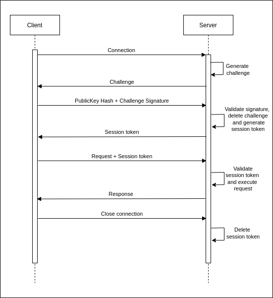

# Implementation of authenticated sessions
___________________________________

## Key generation
___________________________________

Authentication of users, like all communications between the client and server, occurs over a TLS channel. Encrypting all communications from the very beginning of the connection minimizes opportunities for adversaries to hijack or otherwise interfere with connections.

You can use BastionLab’s Client `Identity.create()` function to generate the key pair that will allow both ends to verify with whom they communicate. 

Here’s how the keys are generated:

We use [Python’s cryptography library](https://pypi.org/project/cryptography/) to generate a key pair, using the elliptic curve NIST P-256 algorithm. The Python cryptography library itself uses OpenSSL, a standard library for cryptography.
The keys are saved to the bin directory and labeled as `foo` (private key) and `foo.pub` (public key).
You must share your public key with the server or the data owner so it can be added to the set of trusted keys when the server is initiated.

The transfer of the public key to the data owner is not something we cover. We leave it to you to choose a trusted means of transferring your public key.

!!! important

	You do not have to generate the key with BastionLab. You can  do it with any other means (OpenSSL for example), but the keys **must be generated using the NIST P-256 elliptic curve algorithm**. 

## Key management
___________________________________

We are working under the assumption that the server is hosted on the data owner’s infrastructure and that the infrastructure is trusted and safe.

The keys are stored in the bin directory with the following directory structure:
```
bin/keys:
|
	-owners:
		-owner’s public key
	-users:
		-user 1’s public key
		-user 2’s public key
		- …
```

When the server is initiated the keys are loaded from the directory. The keys are never read again until a server restart. This means that no keys can be added while the server is running.

## Authentication
___________________________________

Authentication in BastionLab is designed to be simple and strong.

Since we don’t use passwords (or the ability to reset them), the private key is the only proof of identity.

When a connection is established, a challenge is generated and sent to the client. The client signs this challenge with their private key and returns it along with a hash of their public key.
The server verifies that it has a public key loaded matching the returned public key hash, before validating the signature using the public key.

Then, the server generates a session token which it shares with the client and stores until the connection disconnects or the session expires.

The client uses the session token to authenticate each request it sends from there on out.

### Specifications

The challenges are generated using the ring crate. A seed is generated by a call to `SystemRandom` and the challenge is a 32-bit random number generated by a call to `ring::rand()`.

The signature algorithm is `ECDSA P256-SHA256 .

The cryptography module is used in the client end to generate the signature.
The ring crate is used in the server end to verify the signature.
The spki crate is used to load the public key into memory.
 
The session tokens are generated exactly as the challenges are, producing a 32-bit random number. 

Session token validation includes matching the client IP for which the session token was generated.

The session tokens have a lifetime of 1500 seconds. 
Should a session expire, the client will automatically generate a new session when a request is sent (this will require authentication to happen again with a challenge being issued and verified, but it is silent and automatic requiring no interaction from the client). 
*The session expiry update as mentioned above remains to be merged.


### Flow


