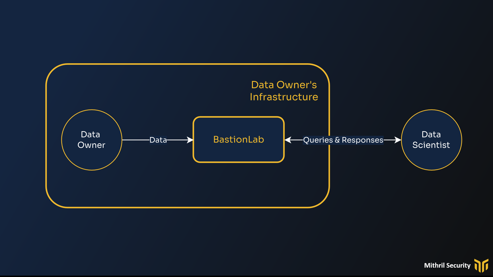

# Scenario - The data owner owns the infrastructure
__________________________________________________________________________

We'll address in this security guide the following threat model scenario:

- **The data owner owns the infrastructure**, meaning the dataset does not leave its premises and the owner provides the computing and opens access to a remote data scientist to work on it. 

- The **remote data scientist is not trusted**, and BastionLab aims to ensure minimal data exposure for the data owner while providing a smooth and interactive experience for the remote data scientist.

BastionLab seeks to protect data as it is not directly accessible by untrusted data scientists. For more information on how it is implemented, look at our guide on [remote data science](https://bastionlab.readthedocs.io/en/latest/docs/concepts-guides/remote_data_science/). 

To guarantee privacy we must identify every threat leading to data exposure and the measures BastionLab implements to defend against them. 

The parties involved are depicted below:

In the gold rectangle are out trusted parties: the data owner and his infrastructure. The untrusted party is the data scientist, which represents the threat. The data scientist, through external queries, could try to exfiltrate data from the data owner infrastructure without their knowledge. We provide one such example [here](), where model trained on-premise is used to steal data.

Let’s look at threats to the data and how BastionLab defends against them:

| Target | Actor                | Threat                                         | Mitigation                                                                      | Result                                                   | Impact | Likelihood |
| ------ | -------------------- | ---------------------------------------------- | ------------------------------------------------------------------------------- | -------------------------------------------------------- | ------ | ---------- |
| Data   | Data Scientist       | Reconstruction of source data through queries  | Aggregation providing k-anonymity in the returned response                      | Data remains anonymous                                   | High   | Low        |
| Data   | Data Scientist       | Extraction of individual data elements or rows | Queries that do not perform an aggregation require approval from the data owner | Individual elements and rows are not returned by default | High   | *Medium    |
| Data   | Unauthorized Parties | Access to the dataset by unauthorized parties  | Each session is authenticated at connection with PKI                            | Data is inaccessible                                     | High   | Low        |
| Data   | Data Scientist       | Remote code execution                          | Only allowed operators are executed on data, no custom code is executed         | Data unimpacted                                          | High   | Low        |
| Data   | Unauthorized Parties | Sniffing                                       | All communications are handled through TLS channels                             | Data is encrypted                                        | High   | Low        |

*\* The likelihood of these threats succeeding is based on the actions of the data owner. For example, the data owner may approve an operation that does not perform an aggregation and returns an individual row to the data scientist.*
